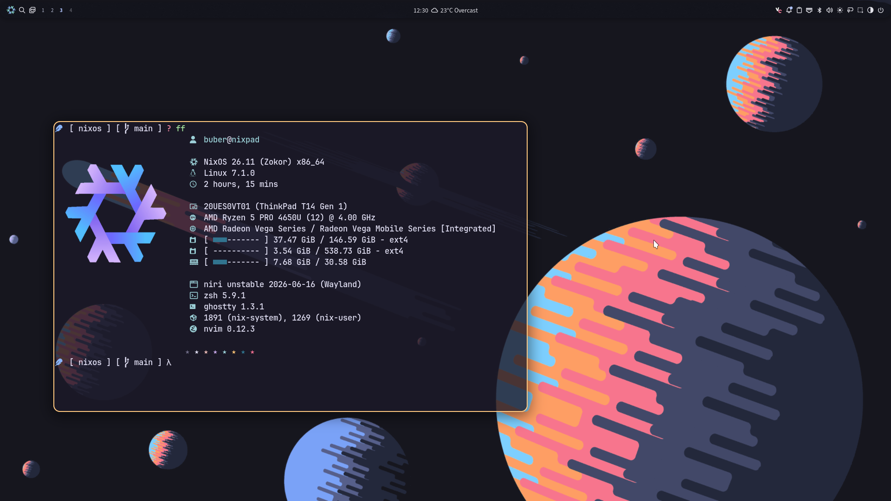

# Nixos Niri Noctalia stack

A NixOS flake configuration for two ThinkPad laptops, built around [Niri](https://github.com/YaLTeR/niri) and [noctalia](https://github.com/noctalia-dev/noctalia), themed with [Stylix](https://github.com/danth/stylix) and [Catppuccin](https://github.com/catppuccin/nix).



## Overview

This repository declaratively configures two machines from a single flake:

| Host       | Hardware                          | CPU   |
|------------|------------------------------------|-------|
| `thinkpad` | Lenovo ThinkPad T460                | Intel |
| `nixpad`   | Lenovo ThinkPad T14 AMD Gen 1        | AMD   |

Both run the same desktop stack — Niri as the compositor, noctalia as the shell/bar/launcher, and noctalia-greeter as the login screen — kept in sync through shared modules, with only hardware-specific bits split out per host.

## Stack

- **Window management:** [Niri](https://github.com/YaLTeR/niri), a scrollable-tiling Wayland compositor
- **Shell / bar / launcher:** [noctalia](https://github.com/noctalia-dev/noctalia) and [noctalia-greeter](https://github.com/noctalia-dev/noctalia-greeter)
- **Theming:** [Stylix](https://github.com/danth/stylix) base16 theming with [Catppuccin Mocha](https://github.com/catppuccin/nix) accents
- **Home management:** [home-manager](https://github.com/nix-community/home-manager)
- **Editor:** [Neovim via nixvim](https://github.com/nix-community/nixvim), plus VS Code
- **Terminal:** [ghostty](https://ghostty.org/)
- **Shell:** zsh with starship, zoxide, eza, fzf
- **Secrets:** [sops-nix](https://github.com/Mic92/sops-nix) for encrypting tokens and SSH signing keys
- **Password manager:** KeepassXC

## Repository structure

```
.
├── flake.nix              # Entry point — defines nixosConfigurations for each host
├── flake.lock
├── hosts/
│   ├── thinkpad/           # Host-specific config, hardware scan, variables, secrets
│   └── nixpad/
├── nixos/                  # Shared system-level modules (audio, fonts, boot, niri, etc.)
├── home/
│   ├── programs/           # Per-app home-manager modules (ghostty, nixvim, git, keepassxc, ...)
│   └── system/             # Desktop-environment-level home modules (niri, noctalia, mime, ...)
├── themes/                 # Stylix/Catppuccin color scheme definitions
└── LICENSE
```

## Usage

Rebuild a specific host from the repository root:

```bash
sudo nixos-rebuild switch --flake .#thinkpad
# or
sudo nixos-rebuild switch --flake .#nixpad
```

If you're using [`nh`](https://github.com/nix-community/nh) (enabled in this config), the included shell aliases are quicker:

```bash
fr   # nh os switch <config-dir> --hostname <hostname>
fu   # same, but updates inputs first
```

### Secrets

Each host keeps its own `secrets.yaml`, encrypted with [sops-nix](https://github.com/Mic92/sops-nix) and an age key. You'll need your own age key at `~/.config/sops/age/keys.txt` (or wherever `secrets/default.nix` points) before secrets can be decrypted on a new machine.

## Adding a new host

1. Create `hosts/<name>/` with `configuration.nix`, `hardware-configuration.nix`, `variables.nix`, and `home.nix`, using an existing host as a template.
2. Add a matching `nixosConfigurations.<name>` block in `flake.nix`, pointing at the right `nixos-hardware` module for your hardware.
3. Update `hosts/<name>/variables.nix` with the new hostname, username, and locale settings.

## Credits

Built on top of the excellent work from the [Niri](https://github.com/YaLTeR/niri), [noctalia](https://github.com/noctalia-dev/noctalia), [Stylix](https://github.com/danth/stylix), and [home-manager](https://github.com/nix-community/home-manager) projects.

## License

MIT — see [LICENSE](./LICENSE).
